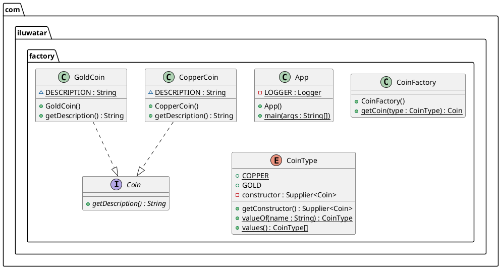

#设计模式 
# 工厂模式
最常用设计模式之一。

> 在工厂模式中，我们在创建对象时不会对客户端暴露创建逻辑，并且是通过使用一个共同的接口来指向新创建的对象。>>[origin](bookxnotepro://opennote/?nb={9833d5f6-11dc-4de6-aa28-ad954fcd7b39}&book=7eabb49ad2889d0340c6065564807054&page=4&x=297&y=586&id=19&uuid=9293844a46be13cd27bdfa2491b0fe22)

---

> ## 介绍
> 意图：定义一个创建对象的接口，让其子类自己决定实例化哪一个工厂类，工厂模式使其创建过程延迟到子类进行。
> 主要解决：主要解决接口选择的问题。
> 何时使用：我们明确地计划不同条件下创建不同实例时。
> 如何解决：让其子类实现工厂接口，返回的也是一个抽象的产品。
> 关键代码：创建过程在其子类执行。 [005](bookxnotepro://opennote/?nb={9833d5f6-11dc-4de6-aa28-ad954fcd7b39}&book=7eabb49ad2889d0340c6065564807054&page=4&x=299&y=712&id=20&uuid=311aa6bb6e0e0b6519a8072b35515737)

> ## 优点：
>  1. 一个调用者想创建一个对象，只要知道其名称就可以了。 
>  2. 扩展性高，如果想增加一个产品，只要扩展一个工厂类就可以。 
>  3. 屏蔽产品的具体实现，调用者只关心产品的接口。
> 
> 缺点：
> - 每次增加一个产品时，都需要增加一个具体类和对象实现工厂，使得系统中类的个数成倍增加，在一定程度上增加了系统的复杂度，同时也增加了系统具体类的依赖。这并不是什么好事。>>[origin](bookxnotepro://opennote/?nb={9833d5f6-11dc-4de6-aa28-ad954fcd7b39}&book=7eabb49ad2889d0340c6065564807054&page=5&x=299&y=117&id=21&uuid=9299712fa4629aff818932b02c0a4c52)
## 代码实现: 
```C++
/*
 * C++ Design Patterns: Factory Method
 * Author: Jakub Vojvoda [github.com/JakubVojvoda]
 * 2016
 *
 * Source code is licensed under MIT License
 * (for more details see LICENSE)
 *
 */

#include <iostream>
#include <string>

/*
 * Product
 * products implement the same interface so that the classes can refer
 * to the interface not the concrete product
 */
class Product
{
public:
    virtual ~Product() {}

    virtual std::string getName() = 0;
    // ...
};

/*
 * Concrete Product
 * define product to be created
 */
class ConcreteProductA : public Product
{
public:
    ~ConcreteProductA() {}

    std::string getName()
    {
        return "type A";
    }
    // ...
};

/*
 * Concrete Product
 * define product to be created
 */
class ConcreteProductB : public Product
{
public:
    ~ConcreteProductB() {}

    std::string getName()
    {
        return "type B";
    }
    // ...
};

/*
 * Creator
 * contains the implementation for all of the methods
 * to manipulate products except for the factory method
 */
class Creator
{
public:
    virtual ~Creator() {}

    virtual Product *createProductA() = 0;
    virtual Product *createProductB() = 0;

    virtual void removeProduct(Product *product) = 0;

    // ...
};

/*
 * Concrete Creator
 * implements factory method that is responsible for creating
 * one or more concrete products ie. it is class that has
 * the knowledge of how to create the products
 */
class ConcreteCreator : public Creator
{
public:
    ~ConcreteCreator() {}

    Product *createProductA()
    {
        return new ConcreteProductA();
    }

    Product *createProductB()
    {
        return new ConcreteProductB();
    }

    void removeProduct(Product *product)
    {
        delete product;
    }
    // ...
};

int main()
{
    Creator *creator = new ConcreteCreator();

    Product *p1 = creator->createProductA();
    std::cout << "Product: " << p1->getName() << std::endl;
    creator->removeProduct(p1);

    Product *p2 = creator->createProductB();
    std::cout << "Product: " << p2->getName() << std::endl;
    creator->removeProduct(p2);

    delete creator;
    return 0;
}

```

```java
public interface Coin {
  String getDescription();
}

public class CoinFactory {
  public static Coin getCoin(CoinType type) {
    return type.getConstructor().get();
  }
}

@RequiredArgsConstructor
@Getter
public enum CoinType {
  COPPER(CopperCoin::new),
  GOLD(GoldCoin::new);
  private final Supplier<Coin> constructor;
}

public class CopperCoin implements Coin {
  static final String DESCRIPTION = "This is a copper coin.";
  @Override
  public String getDescription() {
    return DESCRIPTION;
  }
}

public class GoldCoin implements Coin {
  static final String DESCRIPTION = "This is a gold coin.";
  @Override
  public String getDescription() {
    return DESCRIPTION;
  }
}

@Slf4j
public class App {
  /**
   * Program main entry point.
   */
  public static void main(String[] args) {
    LOGGER.info("The alchemist begins his work.");
    var coin1 = CoinFactory.getCoin(CoinType.COPPER);
    var coin2 = CoinFactory.getCoin(CoinType.GOLD);
    LOGGER.info(coin1.getDescription());
    LOGGER.info(coin2.getDescription());
  }
}

```




# 抽象工厂
抽象工厂模式（Abstract Factory Pattern）是==围绕一个超级工厂创建其他工厂==。该超级工厂又称为其他工厂的工厂。==这种类型的设计模式属于创建型模式，它提供了一种创建对象的最佳方式。==
==在抽象工厂模式中，接口是负责创建一个相关对象的工厂，不需要显式指定它们的类。==
## 介绍
意图：提供一个创建一系列相关或相互依赖对象的接口，而无需指定它们具体的类。
主要解决：主要解决接口选择的问题。
何时使用：系统的产品有多于一个的产品族，而系统只消费其中某一族的产品。
如何解决：在一个产品族里面，定义多个产品。
关键代码：在一个工厂里聚合多个同类产品。
## 应用实例：
工作了，为了参加一些聚会，肯定有两套或多套衣服吧，比如说有商务装（成套，一系列具体产品）、时尚装（成套，一系列具体产品），甚至对于一个家庭来说，可能有商务女装、商务男
装、时尚女装、时尚男装，这些也都是成套的，即一系列具体产品。假设一种情况（现实中是不存在的，要不然，没法进入共产主义了，但有利于说明抽象工厂模式），在您的家中，某一个衣柜（具体工厂）只能存放某一种这样的衣服（成套，一系列具体产品），每次拿这种成套的衣服时也自然要从这个衣柜中取出了。用 OO 的思想去理解，所有的衣柜（具体工厂）都是衣柜类的（抽象工厂）某一个，而每一件成套的衣服又包括具体的上衣（某一具体产品），裤子（某一具体产品），这些具体的上衣其实也都是上衣（抽象产品），具体的裤子也都是裤子（另一个抽象产品）。
## 优点：
当一个产品族中的多个对象被设计成一起工作时，它能保证客户端始终只使用同一个产品族中的对象。
## 缺点：
==产品族扩展非常困难==，要增加一个系列的某一产品，既要在抽象的 Creator 里加代码，又要在具体的里面加代码。
使用场景： 1、QQ 换皮肤，一整套一起换。 2、生成不同操作系统的程序。
注意事项：产品族难扩展，产品等级易扩展。
## 代码实现
```c++
/*
 * C++ Design Patterns: Abstract Factory
 * Author: Jakub Vojvoda [github.com/JakubVojvoda]
 * 2016
 *
 * Source code is licensed under MIT License
 * (for more details see LICENSE)
 *
 */

#include <iostream>

/*
 * Product A
 * products implement the same interface so that the classes can refer
 * to the interface not the concrete product
 */
class ProductA
{
public:
  virtual ~ProductA() {}
  
  virtual const char* getName() = 0;
  // ...
};

/*
 * ConcreteProductAX and ConcreteProductAY
 * define objects to be created by concrete factory
 */
class ConcreteProductAX : public ProductA
{
public:
  ~ConcreteProductAX() {}
  
  const char* getName()
  {
    return "A-X";
  }
  // ...
};

class ConcreteProductAY : public ProductA
{
public:
  ~ConcreteProductAY() {}
  
  const char* getName()
  {
    return "A-Y";
  }
  // ...
};

/*
 * Product B
 * same as Product A, Product B declares interface for concrete products
 * where each can produce an entire set of products
 */
class ProductB
{
public:
  virtual ~ProductB() {}
  
  virtual const char* getName() = 0;
  // ...
};

/*
 * ConcreteProductBX and ConcreteProductBY
 * same as previous concrete product classes
 */
class ConcreteProductBX : public ProductB
{
public:
  ~ConcreteProductBX() {}
  
  const char* getName()
  {
    return "B-X";
  }
  // ...
};

class ConcreteProductBY : public ProductB
{
public:
  ~ConcreteProductBY() {}
  
  const char* getName()
  {
    return "B-Y";
  }
  // ...
};

/*
 * Abstract Factory
 * provides an abstract interface for creating a family of products
 */
class AbstractFactory
{
public:
  virtual ~AbstractFactory() {}
  
  virtual ProductA *createProductA() = 0;
  virtual ProductB *createProductB() = 0;
};

/*
 * Concrete Factory X and Y
 * each concrete factory create a family of products and client uses
 * one of these factories so it never has to instantiate a product object
 */
class ConcreteFactoryX : public AbstractFactory
{
public:
  ~ConcreteFactoryX() {}
  
  ProductA *createProductA()
  {
    return new ConcreteProductAX();
  }
  ProductB *createProductB()
  {
    return new ConcreteProductBX();
  }
  // ...
};

class ConcreteFactoryY : public AbstractFactory
{
public:
  ~ConcreteFactoryY() {}

  ProductA *createProductA()
  {
    return new ConcreteProductAY();
  }
  ProductB *createProductB()
  {
    return new ConcreteProductBY();
  }
  // ...
};


int main()
{
  ConcreteFactoryX *factoryX = new ConcreteFactoryX();
  ConcreteFactoryY *factoryY = new ConcreteFactoryY();

  ProductA *p1 = factoryX->createProductA();
  std::cout << "Product: " << p1->getName() << std::endl;
  
  ProductA *p2 = factoryY->createProductA();
  std::cout << "Product: " << p2->getName() << std::endl;
  
  delete p1;
  delete p2;
  
  delete factoryX;
  delete factoryY;
  
  return 0;
}

```
java 实例太长,在新页面查看[[抽象工厂Java implement in github]]

